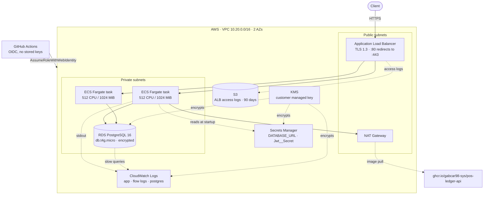

# Infrastructure

Terraform for running `pos-ledger-api` on AWS: ECS Fargate behind an Application Load Balancer,
RDS PostgreSQL in private subnets, secrets in Secrets Manager, and a GitHub Actions deploy role
that holds no long-lived AWS keys.

> **Status — read this before drawing conclusions.**
> This configuration is validated in CI on every pull request: `fmt`, `validate`, `tflint`,
> `checkov`, and a full `terraform plan` that renders all 65 resources. It has **not** been applied
> to a live AWS account, because the stack below costs roughly **$120/month** and this repository
> is not funded. The demo people can actually click on runs on Render's free tier
> (see the root `README.md`).
>
> Saying so is the point. Infrastructure code that claims a deployment it never had is worth less
> than infrastructure code that says exactly how far it was taken.

## Architecture



Nothing in the private subnets is reachable from the internet. The load balancer's egress is
restricted to the tasks — a load balancer that can reach the whole internet is an exfiltration
path with no upside — and the database accepts connections only from the tasks' security group.

## Validate it yourself

No AWS account and no credentials needed. The configuration deliberately contains **no data
sources that read live AWS state**, which is what makes the whole graph render offline.

```bash
cd infra
terraform init -backend=false
terraform validate
terraform plan -var offline_plan=true    # Plan: 65 to add, 0 to change, 0 to destroy
```

`offline_plan` sets `skip_credentials_validation`, `skip_requesting_account_id` and
`skip_metadata_api_check` on the provider. It exists for CI and must never be set for an apply.

Security scanning, the same way CI runs it:

```bash
docker run --rm -v "$PWD/infra:/tf" bridgecrew/checkov:latest -d /tf --framework terraform --compact
```

Current result: **215 passed, 0 failed, 17 skipped**. Every skip is an inline
`# checkov:skip=` comment sitting next to the resource it applies to, and every one carries the
reason it was accepted. A blanket skip list in a config file is how a security scanner becomes
decoration — and `soft_fail: false` in the workflow means an unjustified finding fails the build.

## What it costs

Estimated from published us-east-1 list prices, computed by hand — not from an Infracost run,
which needs an account this repository does not have. Data transfer out is excluded because it
depends entirely on traffic.

| Line | Monthly | Note |
| --- | ---: | --- |
| **NAT Gateway** | **~$33** | `$0.045/hr` plus `$0.045/GB`. The single most expensive item here. |
| ECS Fargate | ~$36 | 2 tasks × 0.5 vCPU / 1 GiB, running continuously |
| Application Load Balancer | ~$22 | `$0.0225/hr` plus LCU charges at low traffic |
| RDS `db.t4g.micro` + 20 GB gp3 | ~$14 | single-AZ; backups inside the free allowance |
| CloudWatch (logs, Container Insights) | ~$10 | dominated by VPC flow logs at `traffic_type = ALL` |
| KMS key | ~$1 | plus request charges |
| Secrets Manager | ~$1 | 2 secrets |
| S3 access logs | <$1 | expire at 90 days |
| **Total** | **~$118** | before data transfer |

The NAT gateway costing more than the database is the detail worth knowing. There is one, not one
per availability zone, which is a deliberate trade: it saves ~$33/month and means an AZ failure
takes out image pulls until the tasks are rescheduled. A production stack runs one per AZ and pays
for it.

The cheaper shapes, if this had to fit a smaller budget: VPC endpoints for ECR/Secrets Manager
instead of NAT (cheaper only above a certain volume), Fargate Spot for non-critical tasks, or
dropping to a single task and letting the circuit breaker handle failed deploys.

## Deliberately not here

Absences worth naming, so they read as decisions rather than oversights:

- **WAF on the load balancer.** The right answer for a public payments endpoint, left out for cost
  (~$5/month plus per-rule and per-request charges). First thing to add if this stops being a demo.
- **Automatic secret rotation.** Needs a rotation Lambda that changes the RDS password and updates
  the secret in the right order. That is real work, not a checkbox, so it is listed rather than
  claimed.
- **Multi-AZ RDS.** Doubles the database bill. A business decision, not a technical one; flipping
  `multi_az` is the whole change.
- **A configured backend.** `versions.tf` leaves the `backend "s3"` block commented out on purpose.
  Hardcoding someone else's bucket into a public repository is noise; the bucket and lock table
  belong in `-backend-config`.

## Notes on a few choices

**Migrations do not run on task startup.** Several tasks roll at once and would race each other,
so `Database__MigrateOnStartup` is `false` here and `true` in the local compose file. See
`docs/adr/0005-migrations-on-startup.md`.

**The deploy role is OIDC-only and scoped to this repository**, to `refs/heads/main` and
`refs/tags/v*`. Without that `sub` condition any repository on GitHub could assume it — the
classic OIDC misconfiguration. Its policy can roll the service onto a new image and nothing else:
it cannot create infrastructure, read secrets, or reach the database.

**The KMS key carries an explicit policy.** A key with the default policy cannot be used by
CloudWatch Logs at all, and log group creation then fails at apply time with an opaque
`AccessDenied`. The service principal is granted use of the key scoped by encryption context, so
it can only ever wrap keys for log groups in this account.

**The database parameter group turns logging on**: `rds.force_ssl`, statements slower than a
second, DDL, connections, and `log_lock_waits`. Sales take row locks, so deadlocks are the failure
mode this schema is most exposed to; if one ever happens the log has to say which two statements
it was.

## Applying it for real

Not recommended without watching the bill, but for completeness:

```bash
terraform init -backend-config=...
terraform apply \
  -var account_id=123456789012 \
  -var certificate_arn=arn:aws:acm:us-east-1:123456789012:certificate/... \
  -var github_repository=owner/repo
```

`account_id` and `certificate_arn` have placeholder defaults so that `plan` renders in CI. Both
must be replaced for an apply — the placeholders are syntactically valid and functionally useless,
which is the intended failure mode.
